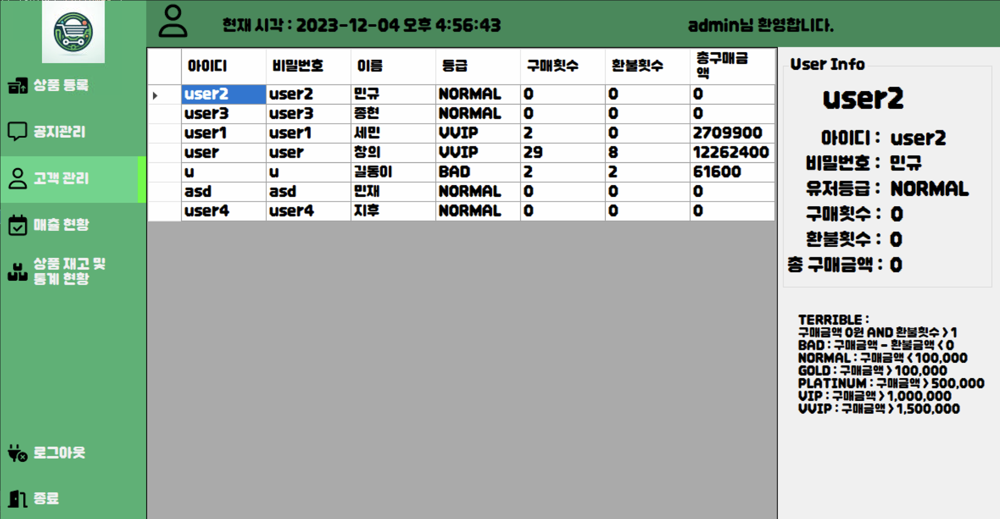

# OfflineMartManagement

오프라인 회원제 공산품 마트 데이터베이스 및 응용 프로그램 구현하기
 
다음 요구 사항을 만족하는 데이터베이스를 설계, 구현하시오. 명시 되지 않은 내용은 본인이 직접 요구 사항을 추가
 
## 요구사항
- 판매하는 상품 종류는 20가지 이상 (각 종류 당 10개 이상의 상품)
- 회원 수 10명 이상
 
## 기능 
### 회원
- 회원 가입 및 탈퇴
- 상품 장바구니 담기 (1번 결재에 여러 개의 상품을 구매 가능,
  결재 기능은 현금으로 구매했다고 가정, 구매 일자는 직접 입력)
- 상품에 대한 후기 작성 기능 및 다른 사람이 작성한 후기 확인
 
### 판매자 -  ID가 있음
- 상품 구매 처리
  (구매는 11월 1일부터 11월 26일까지 이루어진 것으로 가정하고 데이터 입력)
- 고객의 상품 환불 요청 처리 (구매 일자 이후에만 환불 가능)
 
### 관리자
- 신규 상품 입고 및 상품 가격 공지, 가격 변경
   (가격 변경 내역도 저장, 가격 공지 및 변경 이후 상품 구매 가격은
  변경 내용과 일치해야 함 )
- 매장 재고 현황 파악 (판매가능, 반품된 것, ..)
- 상품 구매 내역 관리 (각 회원별 구매 현황 – 구매액수, 구매 횟수, ..)
- 상품 판매액 현황 (상품종류별, 일별, 주별, 요일별 판매 현황)
- 고객 관리 (우수고객, 불량 고객, ..)
- 상품 관리 (환불이 많은 것, 잘 팔리는 것, ..)
- 기타 필요하다고 생각되는 내용 추가

# 결과

### 로그인

### 회원가입

## 유저

### 상품 목록

### 나의 장바구니

### 나의 구매내역

### 공지 확인

### 리뷰 확인

### 리뷰 등록

### 내 정보

## 판매자

### 상품 구매 및 환불 처리

### 고객 관리

## 관리자

### 상품 등록

### 공지 관리

### 고객 관리

### 매출 현황

### 상품 재고 및 통계 현황

